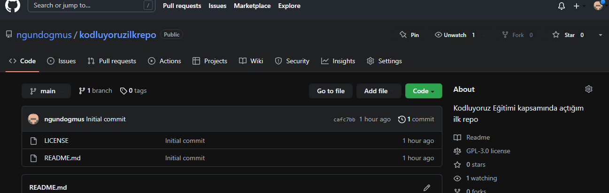

# kodluyoruzilkrepo
Kodluyoruz Eğitimi [Kodluyoruz](https://www.kodluyoruz.org/) kapsamında açtığım ilk repo. İçerisinde **readme dosyası**, bir ader de index.html barındırıyor.

# Installation
Öncelikle projeyi klonlayın.(buraya repo linki gelecek)
`git clone https://github.com/ngundogmus/kodluyoruzilkrepo.git`

# Usage 
Projeyi cloneladıktan sonra Visual studio Code programında açınız.
Linux için
```cd kodluyoruzilkrepo code . ```

# Contributing
Pull requestler kabul edilir.Büyük değişiklikler için lütfen önce neyi değiştirmek istediğinizi tartışmak için bir konu açınız.

# License

[MIT](https://github.com/ngundogmus/kodluyoruzilkrepo.git)




